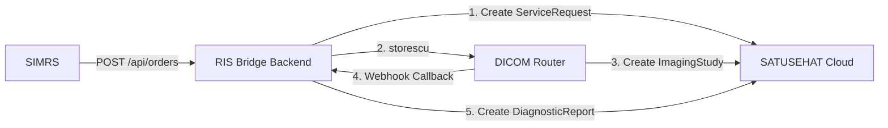

# RIS Bridge

### Interoperabilitas Pencitraan SATUSEHAT Tanpa Kompleksitas PACS Enterprise

[](https://satusehat.kemkes.go.id)
[](https://fastify.dev/)
[](https://www.prisma.io/)
[](https://bullmq.io/)
[](#18-lisensi)

**RIS Bridge** adalah gateway interoperabilitas radiologi yang ringan, efisien, dan ramah pengembang. Aplikasi ini menghubungkan Sistem Informasi Manajemen Rumah Sakit (SIMRS) lokal, file medis DICOM, dan platform SATUSEHAT FHIR API Kementerian Kesehatan RI tanpa memerlukan infrastruktur PACS (*Picture Archiving and Communication System*) enterprise yang mahal.

Aplikasi ini **sepenuhnya memanfaatkan DICOM Router resmi milik SATUSEHAT** untuk menjamin transmisi berkas medis DICOM secara aman dan sinkronisasi status `ImagingStudy` secara otomatis.

Sistem ini didesain khusus bagi rumah sakit yang harus memenuhi regulasi interoperabilitas pencitraan SATUSEHAT tetapi tidak memiliki server PACS enterprise atau lisensi modality worklist yang kompleks.

---

## 1. Pernyataan Masalah (Problem Statement)

Departemen IT Rumah Sakit di Indonesia menghadapi kendala finansial dan operasional yang signifikan saat harus mengintegrasikan alur kerja radiologi dengan Kemenkes SATUSEHAT:
* **PACS Enterprise Sangat Mahal**: Rumah sakit tipe C/D dan klinik pratama sering kali tidak memiliki anggaran untuk lisensi PACS skala besar serta lisensi Modality Worklist (MWL).
* **Integrasi API FHIR yang Rumit**: Memetakan hasil scan medis mentah menjadi resource FHIR seperti `ServiceRequest`, `ImagingStudy`, dan `DiagnosticReport` memerlukan keahlian mendalam tentang standar FHIR.
* **Alat Radiologi (Modality) Lawas Tanpa MWL**: Banyak mesin Rontgen, USG, atau CT scan yang belum mendukung fitur query Modality Worklist secara bawaan.
* **Beban Kerja IT Rumah Sakit**: Tim IT internal rumah sakit memiliki sumber daya terbatas. Solusi integrasi tidak boleh menambah beban pemeliharaan kluster server yang kompleks.

---

## 2. Ikhtisar Solusi (Solution Overview)

RIS Bridge menyederhanakan pipa data ini dengan menjadi lapisan integrasi drop-in yang ringan yang **sepenuhnya memanfaatkan DICOM Router resmi milik SATUSEHAT**:

```
┌──────────┐     ┌───────────┐     ┌──────────────────────┐     ┌──────────────┐
│   SIMRS   │────▶│ RIS Bridge │────▶│ DICOM Router         │────▶│  SATUSEHAT   │
│           │     │  (Backend) │     │ (Resmi SATUSEHAT)    │     │  FHIR API    │
└──────────┘     └───────────┘     └──────────────────────┘     └──────────────┘
```

1. **SIMRS** hanya perlu mengirimkan payload API JSON sederhana ke RIS Bridge.
2. **RIS Bridge** membuat nomor Accession unik secara atomik dan mengirimkan resource `ServiceRequest` ke SATUSEHAT.
3. **Radiografer** mengunggah file gambar DICOM (`.dcm`) mentah melalui portal web RIS Bridge.
4. **RIS Bridge** secara otomatis menyuntikkan metadata (menggunakan `dcmodify`) dan mengirimkan file (via `storescu`) ke **DICOM Router resmi milik SATUSEHAT**.
5. **DICOM Router (SATUSEHAT)** mengunggah data `ImagingStudy` ke SATUSEHAT dan memicu callback webhook untuk menyinkronkan status di RIS Bridge.
6. **Radiolog** menginput hasil bacaan (*freetext*) di antarmuka RIS Bridge, yang kemudian otomatis dikirim sebagai resource `DiagnosticReport` ke SATUSEHAT.

> [!TIP]
> **Tidak Perlu Mengganti PACS**: RIS Bridge berjalan berdampingan dengan sistem penyimpanan file lokal yang sudah ada, tanpa mengganggu alur kerja harian radiologi.

---

## 3. Fitur Utama (Key Features)

* **Otomatisasi SATUSEHAT**: Mengotomatiskan seluruh siklus hidup resource `ServiceRequest`, `ImagingStudy`, dan `DiagnosticReport`.
* **Injeksi Metadata Otomatis**: Memodifikasi tag DICOM secara dinamis menggunakan utilitas CLI DCMTK (`dcmodify`) tepat saat file diunggah.
* **Antrean Pemrosesan Asinkron**: Mengelola pemrosesan file dan transmisi jaringan dengan andal menggunakan Redis dan BullMQ.
* **Pemantauan Docker/Podman Terintegrasi**: Memantau status, melihat log kontainer secara real-time, dan melakukan restart layanan langsung dari dashboard.
* **Ringan & Efisien**: Berjalan sebagai proses Node.js yang hemat sumber daya beserta kontainer database transaksi dan cache yang ringan.
* **Pencarian Order Cepat**: Mempermudah pelacakan status pemeriksaan radiologi melalui pencarian teks instan berdasarkan MRN, Nama Pasien, atau Nomor Accession.

---

## 4. Mengapa RIS Bridge Ada (Philosophy)

Filosofi utama RIS Bridge adalah **adopsi bertahap** (*gradual adoption*) dan **minim gangguan operasional** (*minimal operational disruption*):
* **Fokus pada Interoperabilitas**: Membantu rumah sakit mematuhi regulasi Kementerian Kesehatan secepat mungkin tanpa menuntut perombakan sistem yang mahal.
* **Migrasi Lembut**: Tidak memaksa pihak rumah sakit untuk membeli lisensi PACS baru atau membayar biaya integrasi vendor alat yang mahal untuk mengaktifkan DICOM Modality Worklist.
* **Sederhana & Fleksibel**: Dapat dideploy dengan mudah di atas mesin virtual standar berbasis Windows Server maupun Linux.

---

## 5. Ikhtisar Arsitektur (Architecture Overview)

Berikut adalah alur integrasi data secara sederhana:



*Untuk diagram jaringan yang lebih detail, batasan tanggung jawab sistem, dan topologi infrastruktur, silakan merujuk pada [ARCHITECTURE.md](file:///d:/PROJECTS/DICOM_Router/docs/ARCHITECTURE.md).*

---

## 6. Ikhtisar Alur Kerja (Workflow Overview)

1. **Buat Order**: SIMRS mengirimkan data pendaftaran order radiologi ke RIS Bridge.
2. **Nomor Accession**: RIS Bridge mengembalikan nomor accession unik (contoh: `XR-20260526-001`).
3. **Proses Scanning**: Radiografer melakukan scanning pada alat medis (*modality*) seperti biasa.
4. **Unggah DICOM**: Radiografer mengekspor file `.dcm` dari alat dan mengunggahnya ke dashboard RIS Bridge.
5. **Kirim Otomatis**: RIS Bridge memproses tag DICOM, mengirimkannya ke DICOM Router, dan memperbarui status setelah menerima callback webhook `ImagingStudy`.
6. **Rilis Ekspertise**: Radiolog menginput hasil ekspertise, lalu sistem otomatis menerbitkan `DiagnosticReport` ke SATUSEHAT.

---

## 7. Placeholder Tangkapan Layar (Screenshots Placeholder)

Berikut adalah rancangan visual antarmuka sistem RIS Bridge:
* **Dashboard Overview**: Monitor ringkasan statistik order harian dan status konektivitas sistem. `[IMAGE PLACEHOLDER: dashboard_overview]`
* **Orders Portal**: Halaman utama untuk pencarian pasien, upload file DICOM, serta pengisian laporan radiolog. `[IMAGE PLACEHOLDER: orders_portal]`
* **Monitoring & Infrastructure**: Antarmuka kendali kontainer Docker/Podman, logs streaming, dan status antrean BullMQ. `[IMAGE PLACEHOLDER: system_monitoring]`

---

## 8. Memulai dengan Cepat (Quick Start)

Pastikan Anda telah memasang **Node.js 22**, **PostgreSQL 16**, dan **Redis 7** pada lingkungan lokal Anda.

```bash
# Clone repositori dan salin konfigurasi env
git clone <repository-url>
cd DICOM_Router
cp .env.example .env

# Jalankan instalasi backend dan database
cd backend
npm install
npm run db:generate
npm run db:migrate
npm run seed

# Jalankan server backend development
npm run dev
```

Untuk menyalakan aplikasi frontend (dashboard):
```bash
cd ../frontend
npm install
npm run dev
```
Buka peramban di [http://localhost:5173](http://localhost:5173) dan masuk menggunakan kredensial default:
* **Username**: `admin`
* **Password**: `admin123`

---

## 9. Instalasi (Installation)

RIS Bridge mendukung berbagai macam opsi deployment:
* **Windows Host**: Menjalankan aplikasi Node.js menggunakan PM2 untuk manajemen proses, dipadukan dengan database lokal PostgreSQL dan Redis untuk Windows.
* **Linux Host**: Berjalan sebagai systemd service dengan dukungan container engine.
* **Podman / Docker Compose**: Menyalakan database PostgreSQL, Redis, dan DICOM Router dalam satu perintah terpadu:
  ```bash
  podman compose up -d
  ```

*Panduan instalasi langkah-demi-langkah, konfigurasi reverse proxy Nginx, dan setup PM2 dapat dibaca di [DEPLOYMENT.md](file:///d:/PROJECTS/DICOM_Router/docs/DEPLOYMENT.md).*

---

## 10. Alur Integrasi SIMRS (SIMRS Integration Flow)

SIMRS tetap memegang kendali penuh atas data master dan alur pendaftaran pasien:
* **Encounter Wajib Ada**: SIMRS wajib mendaftarkan data `Patient` dan `Encounter` terlebih dahulu di SATUSEHAT untuk mendapatkan `encounterId` sebelum membuat order di RIS Bridge.
* **Tanggung Jawab**: RIS Bridge murni mengelola penerbitan `ServiceRequest`, penyelarasan berkas `ImagingStudy`, dan penerbitan `DiagnosticReport`.

#### Contoh Payload Uji Coba Integrasi (Testing Payload Example)

Untuk membuat order baru, SIMRS mengirimkan request HTTP POST sebagai berikut:

**HTTP Request**:
```http
POST /api/orders
Authorization: Bearer <accessToken>
Content-Type: application/json

{
  "encounterId": "ff616031-805f-490c-a7a3-6440bfe12e7a",
  "mrn": "0141878",
  "name": "Ahmad Mustofa Aji",
  "radLocationId": "bae68116-c1ac-4e55-9790-532b5b2d24cf",
  "requester": {
    "pratictionerId": "1004XXXX",
    "pratictionerName": "dr. Soni Abdullah, Sp.JP",
    "department": "Poli Spesialis Jantung"
  },
  "performer": {
    "pratictionerId": "1004XXXX",
    "pratictionerName": "dr. Sungha Ali, Sp.Rad"
  },
  "examCode": "XR_SKULL_AP_LAT",
  "timeOrdered": "2026-04-17T03:47:32+07:00",
  "reasonCode": {
    "code": "T14",
    "display": "Injury of unspecified body region"
  },
  "observationText": "Calvaria tampak normal, Trabekulasi tulang normal, Tak tampak garis fracture, Bentuk dan ukuran sella, tursica normal,Tak tampak tanda-tanda peningkatan TIK, Tak tampak erosi, destruksi maupun proses osteolitik / steoblastik, Tak tampak soft tissue mass / swelling",
  "diagnosticReportText": "Tak tampak fraktur"
}
```

**HTTP Response (201 Created)**:
```json
{
  "success": true,
  "data": {
    "accessionNumber": "XR-20260526-001",
    "orderId": "3a00a12e-13c5-4309-80fb-b09bb68d3748",
    "status": "WAITING_UPLOAD",
    "serviceRequestId": "81203810-128c-482a-967a-1f8139589a1b",
    "encounterId": "2823b811-fb83-4903-a178-0cb95c808796",
    "examCode": "XR_CHEST",
    "examName": "Thorax AP/PA",
    "createdAt": "2026-05-26T02:15:10.000Z"
  }
}
```

*Untuk spesifikasi lengkap API, parameter query, dan penanganan error, silakan lihat [API.md](file:///d:/PROJECTS/DICOM_Router/docs/API.md).*

---

## 11. Alur Kerja DICOM (DICOM Workflow)

Alur kerja radiografer sangat dimudahkan tanpa hambatan operasional:
1. Cari dan pilih order pasien di halaman **Orders** pada dashboard RIS Bridge.
2. Seret dan letakkan (*drag-and-drop*) file `.dcm` yang diekspor dari modality ke dalam area upload.
3. Klik tombol **Upload**.

RIS Bridge akan menangani sisanya secara asinkron melalui antrean BullMQ:
* Memodifikasi tag file DICOM untuk menyuntikkan Accession Number menggunakan CLI `dcmodify`.
* Mengirimkan file ke kontainer DICOM Router melalui CLI `storescu` di port `11112`.

---

## 12. Fitur Infrastruktur (Infrastructure Features)

RIS Bridge dilengkapi dengan fitur monitoring tingkat sistem untuk memudahkan tugas IT rumah sakit:
* **Container Controller**: Mulai, matikan, dan restart kontainer DICOM Router secara dinamis lewat tombol dashboard.
* **Terminal Streamer**: Melihat log keluaran kontainer secara real-time langsung dari web browser.
* **Health & Storage Evaluator**: Memantau konektivitas real-time database, Redis, SATUSEHAT, serta kapasitas ruang disk temporer dengan kebijakan retensi FIFO otomatis.

### Konfigurasi Batas Penyimpanan (Storage Retention)

Seluruh parameter retensi penyimpanan DICOM dapat dikustomisasi langsung dari file `.env` **tanpa perlu mengubah kode** dan tanpa restart proses:

```env
# Folder penyimpanan DICOM sementara
STORAGE_PATH=./storage

# Batas maksimum penyimpanan (default: 40 GB)
STORAGE_MAX_GB=40

# Strategi cleanup: FIFO (tertua dihapus duluan)
STORAGE_CLEANUP_STRATEGY=FIFO

# Hanya hapus studi berstatus COMPLETED (aman untuk diubah)
STORAGE_CLEANUP_ONLY_COMPLETED=true

# Aktifkan auto-cleanup saat limit terlampaui
STORAGE_AUTO_CLEANUP=true

# Maksimum retry pengiriman ke DICOM Router
STORAGE_MAX_RETRY_COUNT=3

# Hapus file fisik setelah retry melebihi batas
STORAGE_DELETE_FAILED_DICOM_AFTER_RETRY=true
```

> [!TIP]
> Sesuaikan nilai `STORAGE_MAX_GB` dengan kapasitas disk server rumah sakit. Sistem akan otomatis membersihkan studi tertua yang sudah `COMPLETED` saat batas terlampaui — metadata database **tetap dipertahankan** untuk keperluan audit.

---

## 13. Tautan Dokumentasi (Documentation Links)

Semua panduan teknis yang mendalam telah dikonsolidasikan ke dalam folder `docs/`:
* **[TECHNICAL.md](file:///d:/PROJECTS/DICOM_Router/docs/TECHNICAL.md)**: Detail antrean BullMQ, siklus hidup file DICOM, manajemen token, dan skema logging.
* **[ARCHITECTURE.md](file:///d:/PROJECTS/DICOM_Router/docs/ARCHITECTURE.md)**: Arsitektur integrasi, batas-batas kepemilikan sistem, dan pemetaan resource FHIR.
* **[API.md](file:///d:/PROJECTS/DICOM_Router/docs/API.md)**: Dokumentasi lengkap API endpoints, format payload JSON, dan response codes.
* **[DEPLOYMENT.md](file:///d:/PROJECTS/DICOM_Router/docs/DEPLOYMENT.md)**: Langkah instalasi di Windows/Linux, setup kontainer, PM2, dan pemulihan bencana.
* **[MWL_ROADMAP.md](file:///d:/PROJECTS/DICOM_Router/docs/MWL_ROADMAP.md)**: Peta jalan 4-fase untuk bertransisi menuju integrasi Modality Worklist (MWL) native.

---

## 14. Peta Jalan (Roadmap)

* **Fase 1 (Saat Ini)**: Alur kerja unggah file DICOM via web secara manual dengan injeksi Accession Number otomatis.
* **Fase 2**: Implementasi Folder Watcher Agent (menangkap file DICOM otomatis dari folder lokal mesin radiologi).
* **Fase 3**: Integrasi SCP Server DICOM C-FIND MWL bawaan.
* **Fase 4**: Alur kerja modality native menggunakan transmisi C-STORE SCP/SCU.

---

## 15. Pemecahan Masalah (Troubleshooting)

* **Status SATUSEHAT disconnected**: Pastikan Client Key dan Secret Key di file `.env` sudah sesuai dengan data DTO Sandbox/Production Kemenkes Anda, serta pastikan server memiliki koneksi internet keluar (outbound port 443).
* **Status Upload DICOM Tertahan di QUEUED**: Periksa status kesehatan service Redis (`redis-cli ping` harus mengembalikan `PONG`) dan pastikan proses worker backend berjalan.
* **Kesalahan eksekusi storescu**: Pastikan perkakas DCMTK (seperti `storescu` dan `dcmodify`) telah terinstal di server dan path-nya terdaftar di system environment variables host.

*Detail pemecahan masalah lebih mendalam dapat dibaca di [DEPLOYMENT.md](file:///d:/PROJECTS/DICOM_Router/docs/DEPLOYMENT.md).*

---

## 16. FAQ (Pertanyaan Umum)

#### Apakah RIS Bridge menggantikan PACS lokal?
Tidak. RIS Bridge murni berfungsi sebagai gateway interoperabilitas SATUSEHAT yang ringan. Aplikasi ini berjalan berdampingan dengan PACS/storage lokal Anda yang sudah ada.

#### Apakah Modality Worklist (MWL) wajib digunakan?
Tidak. Pada Fase 1, radiografer cukup mengunggah file hasil scan secara manual melalui portal web RIS Bridge, sehingga integrasi dapat berjalan tanpa mengubah konfigurasi alat.

#### Apakah SIMRS tetap membuat data Encounter?
Ya. Pendaftaran pasien dan pembuatan Encounter (Kunjungan) tetap sepenuhnya dikelola oleh SIMRS di SATUSEHAT. RIS Bridge hanya memerlukan `encounterId` yang valid untuk menerbitkan data penunjang radiologi.

#### Bagaimana jika radiolog menginput hasil ekspertise dalam bentuk tulisan bebas (plaintext)?
Kemenkes SATUSEHAT memperbolehkan pengisian bacaan radiologi secara freetext melalui kolom `valueString` pada resource `Observation` dan kolom `conclusion` pada resource `DiagnosticReport`. RIS Bridge telah menyesuaikan kebutuhan ini agar rumah sakit dapat bermigrasi secara bertahap tanpa harus langsung menerapkan standar kode LOINC terstruktur.

#### Berapa batas penyimpanan DICOM dan apakah bisa diubah?
Default batas penyimpanan adalah **40 GB**. Nilai ini dapat diubah kapan saja melalui variabel `STORAGE_MAX_GB` di file `.env`. Saat storage mencapai batas, sistem otomatis menghapus studi radiologi tertua yang sudah `COMPLETED` (strategi FIFO) — metadata database selalu dipertahankan untuk keperluan audit dan penelusuran masalah.

---

## 17. Lisensi (License)

Proprietary — Berlisensi khusus untuk penggunaan pada rumah sakit dan fasilitas kesehatan yang berwenang di Indonesia.
