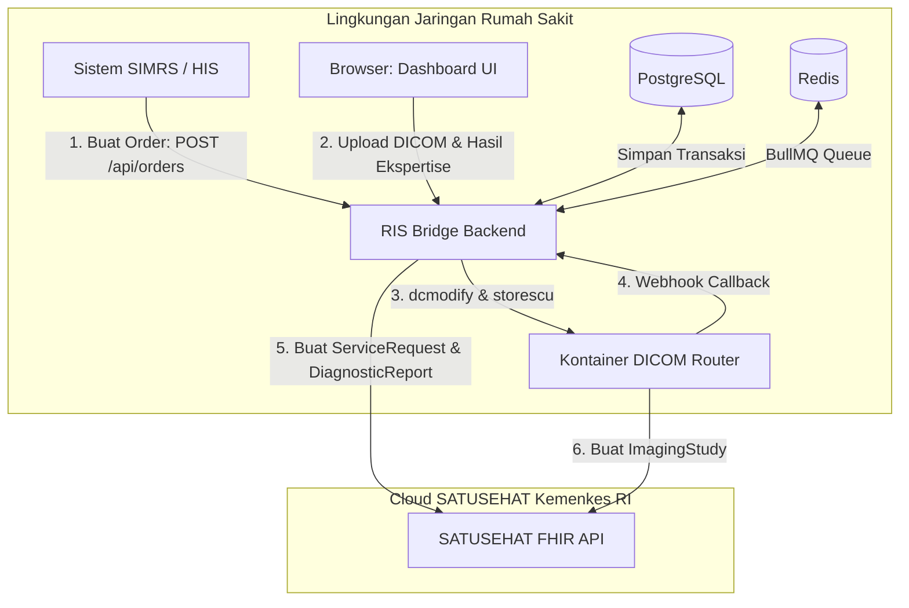
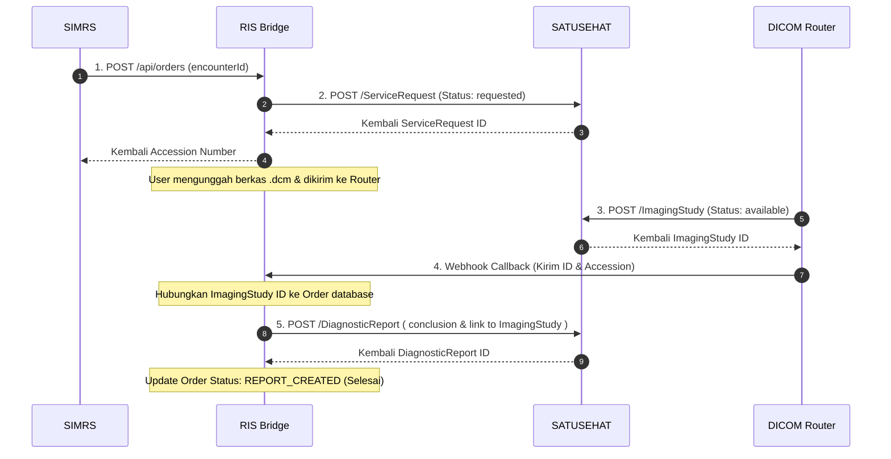

# RIS Bridge — Architecture & Interoperability Design

This document details the high-level system architecture, service boundaries, ownership models, and workflow orchestrations of the **RIS Bridge** platform.

---

## Daftar Isi (Table of Contents)
1. [Arsitektur Sistem Tingkat Tinggi](#1-arsitektur-sistem-tingkat-tinggi)
2. [Matriks Batas Layanan & Kepemilikan Data](#2-matriks-batas-layanan--kepemilikan-data)
3. [Mengapa Accession Number Menjadi Kunci Orkestrasi?](#3-mengapa-accession-number-menjadi-kunci-orkestrasi)
4. [Mengapa Alur Kerja Bersifat Asinkron?](#4-mengapa-alur-kerja-bersifat-asinkron)
5. [Siklus Hidup Resource FHIR SATUSEHAT](#5-siklus-hidup-resource-fhir-satusehat)
6. [Topologi Deployments & Hubungan Jaringan](#6-topologi-deployments--hubungan-jaringan)

---

## 1. Arsitektur Sistem Tingkat Tinggi

RIS Bridge dirancang untuk beroperasi sebagai middleware yang efisien, menghubungkan sistem informasi lokal rumah sakit dengan API SATUSEHAT tanpa memerlukan server PACS (*Picture Archiving and Communication System*) berskala besar.



---

## 2. Matriks Batas Layanan & Kepemilikan Data

Untuk memastikan sistem tidak tumpang tindih dan mudah dipelihara, kepemilikan data dan batas layanan didefinisikan secara ketat sebagai berikut:

```
┌────────────────────────────────────────────────────────┐
│                        SIMRS                           │
│   (Memiliki data: Pasien, Kunjungan/Encounter, Dokter)  │
└───────────────────────────┬────────────────────────────┘
                            │
                  POST /api/orders (encounterId)
                            ▼
┌────────────────────────────────────────────────────────┐
│                     RIS Bridge                         │
│   (Memiliki data: Accession, Order, DiagnosticReport)  │
└───────────────────────────┬────────────────────────────┘
                            │
                  storescu (accessionNumber)
                            ▼
┌────────────────────────────────────────────────────────┐
│                    DICOM Router                        │
│   (Memiliki data: File DICOM Fisik, ImagingStudy ID)   │
└────────────────────────────────────────────────────────┘
```

### 1. Peran & Tanggung Jawab SIMRS:
* **Tanggung Jawab**: SIMRS sepenuhnya memiliki pendaftaran klinis pasien dan pembuatan kunjungan medis. Oleh karena itu, SIMRS wajib membuat data `Patient` dan `Encounter` di SATUSEHAT serta mendapatkan ID resource tersebut sebelum mengirimkan instruksi pemeriksaan ke RIS Bridge.
* **Prasyarat**: RIS Bridge **TIDAK** membuat data `Patient` atau `Encounter` sendiri demi menghindari duplikasi data pasien pada sistem rekam medis elektronik rumah sakit.

### 2. Peran & Tanggung Jawab RIS Bridge:
* **Tanggung Jawab**: RIS Bridge bertanggung jawab atas penerjemahan order SIMRS lokal menjadi instruksi FHIR `ServiceRequest`, pembuatan kode accession yang unik secara atomik, modifikasi metadata medis file gambar, pengiriman gambar via transmisi DICOM SCP, dan sinkronisasi hasil diagnosa ke resource `DiagnosticReport`.

### 3. Peran & Tanggung Jawab DICOM Router:
* **Tanggung Jawab**: DICOM Router bertindak sebagai penerima transmisi DICOM (C-STORE SCP). Tugas utamanya adalah membaca berkas gambar yang dikirim oleh RIS Bridge, mempublikasikannya sebagai FHIR `ImagingStudy` ke SATUSEHAT, lalu mengirimkan webhook callback kembali ke RIS Bridge untuk mencocokkan ID study.

---

## 3. Mengapa Accession Number Menjadi Kunci Orkestrasi?

**Accession Number (ACSN)** bertindak sebagai kunci relasional tunggal (*single correlation key*) di seluruh ekosistem RIS Bridge.

### Mengapa menggunakan ACSN dan bukan Database ID?
1. **Standar Industri Medis**: ACSN adalah pengenal standar di dunia radiologi (DICOM Tag `(0008,0050)`). Seluruh mesin modalitas radiologi (USG, CT Scan, X-Ray) mengenali tag ini secara bawaan.
2. **Korelasi Asinkron**: Ketika kontainer DICOM Router mengirimkan webhook callback berisi status `ImagingStudy`, kontainer tersebut tidak mengetahui ID database internal RIS Bridge. Satu-satunya pengenal medis yang ada di dalam file DICOM adalah ACSN. RIS Bridge menggunakan ACSN tersebut untuk mencari order dan menyelaraskan statusnya.
3. **Kepatuhan SATUSEHAT**: Kemenkes RI menyelaraskan relasi antara `ServiceRequest`, `ImagingStudy`, dan `DiagnosticReport` menggunakan nomor accession yang terdaftar di dalam identifier resource masing-masing.

---

## 4. Mengapa Alur Kerja Bersifat Asinkron?

Transmisi data gambar radiologi (DICOM) melibatkan ukuran berkas yang sangat besar (seringkali berkisar antara 10MB hingga ratusan MB per pemeriksaan). Menjalankan proses ini secara sinkron di tingkat request HTTP adalah keputusan arsitektur yang buruk karena:
* **HTTP Timeout**: Proses unggah, pemrosesan tag metadata, dan transmisi jaringan `storescu` bisa memakan waktu hingga beberapa menit. Menahan koneksi HTTP SIMRS akan memicu kegagalan timeout.
* **Resiliensi Jaringan**: Jika jaringan lokal rumah sakit atau koneksi internet ke SATUSEHAT terputus sementara, pengiriman sinkron akan langsung gagal secara permanen. Dengan antrean asinkron (BullMQ), pekerjaan yang gagal akan ditahan dan dicoba kembali secara otomatis (*auto-retry*) saat sistem kembali pulih.

---

## 5. Siklus Hidup Resource FHIR SATUSEHAT

Urutan pembuatan dan pembaruan status resource medis di platform SATUSEHAT terkoordinasi secara ketat oleh RIS Bridge seperti digambarkan di bawah ini:



---

## 6. Topologi Deployments & Hubungan Jaringan

Di lingkungan rumah sakit, RIS Bridge biasanya dideploy di dalam jaringan lokal (LAN) rumah sakit agar dapat terhubung dengan SIMRS dan mesin modalitas radiologi secara cepat tanpa latensi internet:

```
┌────────────────────────────────────────────────────────────────────────┐
│                        Jaringan LAN Rumah Sakit                        │
│                                                                        │
│  ┌──────────────┐          ┌────────────────────────────────┐          │
│  │    SIMRS     ├─────────▶│       RIS Bridge Server        │          │
│  └──────────────┘          │   (API Port 3000 | Web UI)     │          │
│                            └──────┬──────────────────┬──────┘          │
│                                   │                  │                 │
│                                   ▼                  ▼                 │
│                          ┌──────────────┐   ┌──────────────┐           │
│                          │  PostgreSQL  │   │  Redis Server│           │
│                          └──────────────┘   └──────────────┘           │
│                                   │                                    │
│                                   ▼ (storescu)                         │
│                          ┌────────────────────────────────┐            │
│                          │  DICOM Router Container (Local)│            │
│                          │      (SCP Port 11112)          │            │
│                          └────────────────┬───────────────┘            │
└───────────────────────────────────────────┼────────────────────────────┘
                                            │ (Internet HTTPS)
                                            ▼
                           ┌────────────────────────────────┐
                           │      SATUSEHAT Cloud API       │
                           │   (Platform Kemenkes RI)       │
                           └────────────────────────────────┘
```
* **DICOM Router Container** diletakkan di server yang sama dengan RIS Bridge Backend agar transmisi file lokal menggunakan `storescu` dapat berjalan cepat tanpa hambatan bandwidth jaringan WAN/Internet.
