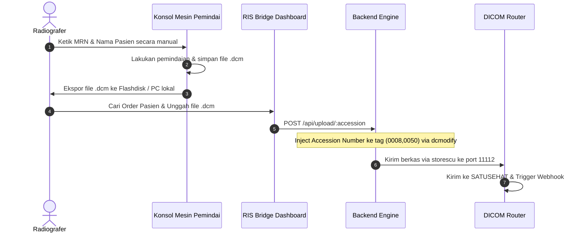
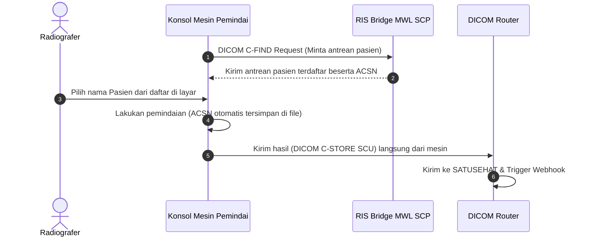

# RIS Bridge — Roadmap Integrasi DICOM Modality Worklist (MWL)

This document presents the strategic integration roadmap for the **DICOM Modality Worklist (MWL)** protocol in **RIS Bridge**. It outlines the current workflow, its limitations, and the evolutionary phases to transition local hospital modalities to a fully automated workflow.

---

## Daftar Isi (Table of Contents)
1. [Apa itu DICOM Modality Worklist (MWL)?](#1-apa-itu-dicom-modality-worklist-mwl)
2. [Alasan Penundaan MWL di Fase Awal (Phase 1)](#2-alasan-penundaan-mwl-di-fase-awal-phase-1)
3. [Alur Kerja Saat Ini (Current Ingestion Flow)](#3-alur-kerja-saat-ini-current-ingestion-flow)
4. [Rencana Migrasi Bertahap (The 4-Phase Roadmap)](#4-rencana-migrasi-bertahap-the-4-phase-roadmap)
5. [Alur Kerja Masa Depan (Future MWL Flow)](#5-alur-kerja-masa-depan-future-mwl-flow)
6. [Tantangan Operasional & Kompatibilitas Mesin](#6-tantangan-operasional--kompatibilitas-mesin)

---

## 1. Apa itu DICOM Modality Worklist (MWL)?

Dalam alur kerja radiologi standar, **DICOM Modality Worklist (MWL)** adalah protokol jaringan medis (DICOM C-FIND) yang memungkinkan mesin pemindai/modalitas (seperti CT, MRI, USG, X-Ray) untuk menanyakan daftar antrean pasien secara langsung dari RIS (Radiology Information System) atau PACS server.

Dengan MWL, radiografer tidak perlu mengetik nama pasien, tanggal lahir, dan nomor accession secara manual pada konsol mesin pemindai. Mereka cukup memilih nama pasien dari daftar antrean elektronik yang muncul di layar mesin, meminimalkan kesalahan pengetikan (*human error*) yang dapat memecah relasi data medis pasien.

---

## 2. Alasan Penundaan MWL di Fase Awal (Phase 1)

RIS Bridge sengaja dirancang untuk **tidak mewajibkan** integrasi MWL di Fase 1 demi alasan pragmatis dan operasional:

1. **Kompatibilitas Mesin Warisan (Legacy Modalities)**: Banyak rumah sakit di Indonesia masih menggunakan mesin radiologi tua yang tidak memiliki lisensi/fitur jaringan DICOM MWL aktif (atau memerlukan biaya aktivasi lisensi software yang mahal dari vendor mesin).
2. **Ketiadaan PACS Server**: Rumah sakit sasaran RIS Bridge umumnya belum memiliki infrastruktur PACS komprehensif, sehingga implementasi protokol MWL SCP (Service Class Provider) yang rumit akan memperlambat adopsi awal sistem.
3. **Mengutamakan Kesederhanaan Deployment**: Dengan mengganti MWL ke alur kerja unggah manual berkas DICOM (.dcm), RIS Bridge dapat diinstalasi dan mulai melapor ke SATUSEHAT hanya dalam waktu kurang dari satu hari tanpa harus mengubah setelan IP dan jaringan pada mesin modalitas radiologi rumah sakit yang berisiko.

---

## 3. Alur Kerja Saat Ini (Current Ingestion Flow)

Pada Fase 1 (Sistem Berjalan Saat Ini), penjaminan keunikan accession number dilakukan melalui injeksi tag metadata pasca-pemindaian:



---

## 4. Rencana Migrasi Bertahap (The 4-Phase Roadmap)

Untuk memodernisasi alur kerja rumah sakit secara perlahan tanpa gangguan drastis pada operasional harian, pengembangan RIS Bridge dibagi menjadi 4 fase evolutif:

```
┌────────────────────────────────────────────────────────┐
│                        Phase 1                         │
│   Manual Upload + Accession Metadata Injection         │
│   (Sistem Saat Ini - Low Friction)                    │
└───────────────────────────┬────────────────────────────┘
                            │
                            ▼
┌────────────────────────────────────────────────────────┐
│                        Phase 2                         │
│   Folder Watcher Automation (Koneksi Folder Lokal)     │
│   (Deteksi berkas otomatis di PC Operator)             │
└───────────────────────────┬────────────────────────────┘
                            │
                            ▼
┌────────────────────────────────────────────────────────┐
│                        Phase 3                         │
│   RIS Bridge MWL C-FIND SCP Server Integration         │
│   (Mesin meminta daftar pasien langsung ke server)     │
└───────────────────────────┬────────────────────────────┘
                            │
                            ▼
┌────────────────────────────────────────────────────────┐
│                        Phase 4                         │
│   Fully Modality-Native PACS Ingestion Workflow        │
│   (Alur kerja nirkabel otomatis tanpa upload manual)   │
└────────────────────────────────────────────────────────┘
```

### Fase 1: Unggah Manual & Injeksi Tag (Current)
* **Deskripsi**: Radiografer memindahkan berkas hasil pemindaian secara manual dan mengunggahnya ke dashboard RIS Bridge. Sistem secara otomatis menyuntikkan Accession Number Kemenkes ke tag gambar.

### Fase 2: Otomatisasi Folder Watcher (Semi-Automatic)
* **Deskripsi**: Penambahan modul agen kecil (*lightweight folder watcher daemon*) pada komputer operator mesin pemindai. Agen ini memantau folder ekspor mesin pemindai secara realtime.
* **Kelebihan**: Begitu file DICOM diekspor dari konsol pemindai, file otomatis terdeteksi, dicocokkan dengan order pasien terdekat berdasarkan jam pemeriksaan, lalu dikirim secara nirkabel ke backend RIS Bridge tanpa proses klik unggah manual.

### Fase 3: Integrasi MWL SCP Server (Fully Automatic Query)
* **Deskripsi**: RIS Bridge Backend mengaktifkan layanan **DICOM C-FIND MWL SCP (Service Class Provider)** internal di port `104` atau `11104`.
* **Kelebihan**: Setelan AE Title dan IP RIS Bridge didaftarkan pada mesin pemindai modalitas. Radiografer cukup menekan tombol "Refresh Worklist" di layar mesin untuk mendapatkan daftar pasien hari itu secara langsung dari database RIS Bridge.

### Fase 4: Modality-Native PACS Workflow (Native)
* **Deskripsi**: Penggabungan alur kerja nirkabel penuh. Mesin pemindai menarik data antrean dari MWL, mengunci tag accession secara orisinal, dan mengirimkan hasil pemindaian langsung menggunakan perintah C-STORE SCU bawaan mesin ke port SCP DICOM Router secara otomatis saat proses "Send Study" ditekan di mesin.

---

## 5. Alur Kerja Masa Depan (Future MWL Flow)

Setelah Fase 3 dan 4 diimplementasikan, alur kerja radiologi rumah sakit akan berubah menjadi bebas kertas (*paperless*) dan bebas ketik manual (*zero manual entry*):



---

## 6. Tantangan Operasional & Kompatibilitas Mesin

Saat melangkah ke Fase 3, tim IT rumah sakit harus mewaspadai tantangan operasional berikut:
1. **Penjadwalan Jaringan LAN**: Mesin modalitas radiologi lama biasanya menggunakan kartu jaringan berkecepatan rendah (10/100 Mbps) yang rawan putus jika mentransmisikan file radiologi berukuran besar.
2. **Karakter Set Encoding**: Banyak mesin radiologi buatan Jepang/Jerman yang tidak mendukung karakter UTF-8 secara bawaan di layar worklist mereka, sehingga membutuhkan translasi khusus di backend RIS Bridge agar nama pasien tidak berantakan (*character encoding mismatch*).
3. **Biaya Aktivasi Lisensi Vendor**: Beberapa pabrikan mesin modalitas mengunci fitur DICOM Worklist di software mereka. IT rumah sakit harus berkoordinasi dengan agen vendor lokal untuk mengaktifkan lisensi software DICOM MWL C-FIND SCU.
