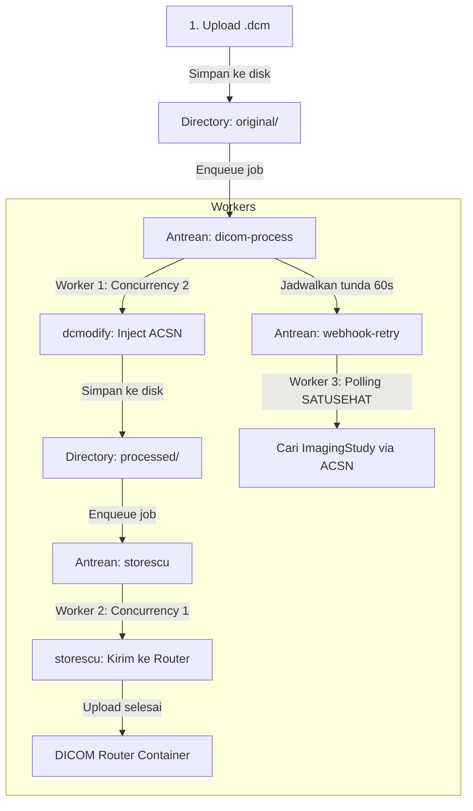
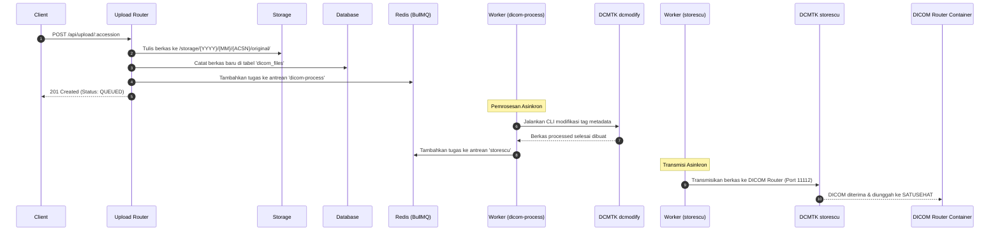
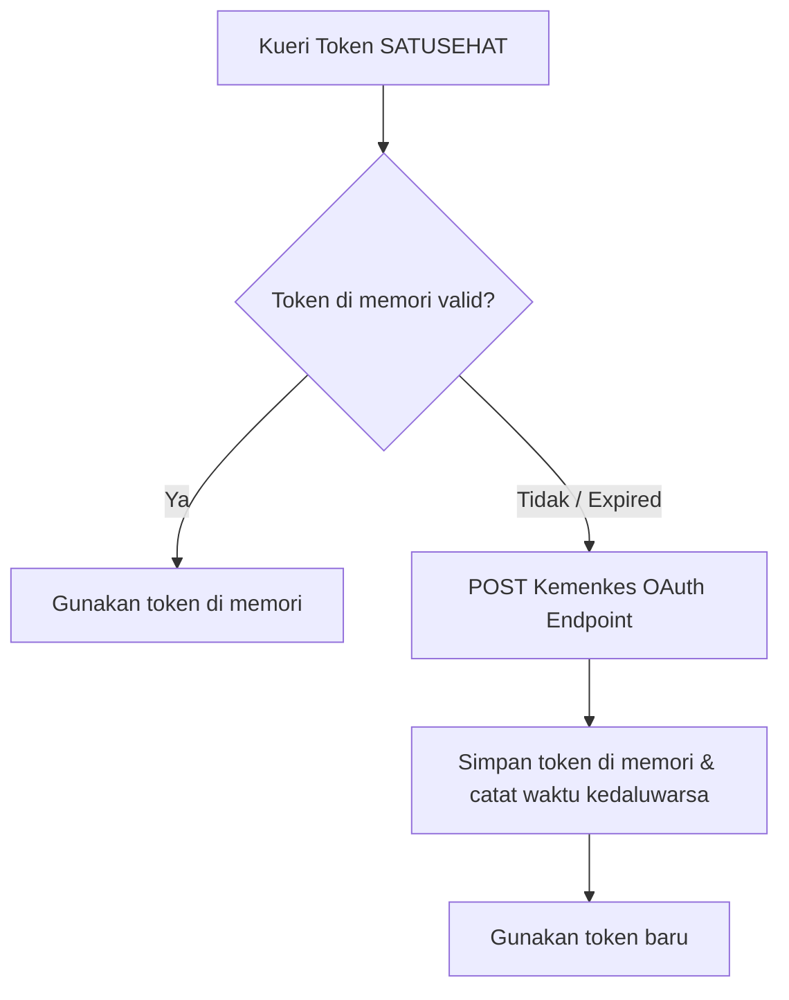

# RIS Bridge — Technical Internals & Specifications

This document provides a deep technical analysis of the internals of **RIS Bridge**. It is designed for software engineers, database administrators, and interoperability experts who maintain, extend, or debug the platform.

---

## Daftar Isi (Table of Contents)
1. [Pilihan Teknologi & Rationale](#1-pilihan-teknologi--rationale)
2. [Struktur Direktori Proyek](#2-struktur-direktori-proyek)
3. [Arsitektur Antrean (BullMQ & Redis)](#3-arsitektur-antrean-bullmq--redis)
4. [Siklus Hidup Pemrosesan DICOM](#4-siklus-hidup-pemrosesan-dicom)
5. [Orkestrasi Nomor Accession](#5-orkestrasi-nomor-accession)
6. [Manajemen Token SATUSEHAT](#6-manajemen-token-satusehat)
7. [Integrasi Webhook & Mekanisme Retrying](#7-integrasi-webhook--mekanisme-retrying)
8. [Orkestrasi Kontainer (Docker & Podman)](#8-orkestrasi-kontainer-docker--podman)
9. [Strategi Logging & Penanganan Error](#9-strategi-logging--penanganan-error)
10. [Manajemen Penyimpanan & Kebijakan Retensi](#10-manajemen-penyimpanan--kebijakan-retensi)

---

## 1. Pilihan Teknologi & Rationale

RIS Bridge dibangun menggunakan tumpukan teknologi modern berkinerja tinggi dengan alasan-alasan teknis berikut:

### Node.js (v22+) & TypeScript
* **Rationale**: TypeScript menghadirkan pengetikan statis (*static typing*) pada lingkungan JavaScript yang fleksibel. Ini meminimalkan bug runtime pada payload data medis terstruktur yang sangat sensitif (misalnya, payload FHIR SATUSEHAT).
* **Asynchronous I/O**: Membantu server mengelola pemrosesan file DICOM secara non-blocking bersamaan dengan I/O database dan antrean Redis.

### Fastify Web Framework
* **Rationale**: Memiliki throughput yang jauh lebih tinggi dan overhead memori yang lebih rendah dibandingkan dengan Express.js.
* **Schema Validation**: Fastify mendukung skema JSON bawaan (menggunakan Ajv) untuk validasi cepat di tingkat router sebelum data diproses lebih lanjut.

### Prisma ORM
* **Rationale**: Menyediakan klien database terketik (*type-safe client*) yang dibuat langsung dari skema deklaratif ([schema.prisma](../backend/prisma/schema.prisma)). Kueri database tervalidasi saat kompilasi, mencegah kesalahan nama kolom atau tipe data yang tidak cocok.

### Redis & BullMQ
* **Rationale**: BullMQ menyediakan mekanisme antrean berbasis Redis yang tangguh dengan dukungan bawaan untuk kegagalan tugas (*job failures*), retrying asinkron, penundaan (*delayed jobs*), serta kontrol konkurensi. Ini sangat krusial untuk mengamankan data DICOM agar tidak hilang saat jaringan rumah sakit atau SATUSEHAT mengalami kegagalan transmisi.

---

## 2. Struktur Direktori Proyek

RIS Bridge memisahkan modul-modul bisnis secara teratur untuk mempermudah pengembangan jangka panjang.

```
DICOM_Router/
├── backend/                       # Aplikasi Server Utama (API + Workers)
│   ├── prisma/                    # Skema database & file migrasi / seed
│   └── src/
│       ├── app.ts                 # Bootstrapping Fastify server & route loading
│       ├── server.ts              # Entry point utama aplikasi
│       ├── config/                # Loader variabel lingkungan (.env)
│       ├── lib/                   # Utilitas sharing (Prisma instance, Logger, Redis)
│       ├── types/                 # Pengetikan global (FHIR, database, payload)
│       ├── bootstrap/             # Langkah inisialisasi awal server
│       ├── modules/               # Folder fitur berbasis modul
│       │   ├── auth/              # Manajemen sesi & JWT token
│       │   ├── orders/            # Pembuatan & kueri order radiologi
│       │   ├── upload/            # Ingesti berkas DICOM (.dcm)
│       │   ├── dicom/             # dcmodify metadata injection & storescu
│       │   ├── webhook/           # Penerima callback ImagingStudy dari Router
│       │   ├── reports/           # Pengiriman DiagnosticReport ke SATUSEHAT
│       │   └── infrastructure/    # Manajemen kontrol kontainer local
│       └── services/              # Integrasi eksternal (SATUSEHAT & queues)
└── frontend/                      # Aplikasi Dashboard UI (Vue 3 Single Page App)
    └── src/
        ├── api/                   # Klien Axios dengan JWT interceptors
        ├── layouts/               # Kerangka visual sidebar dan navbar
        ├── pages/                 # Halaman utama (Orders & System Monitoring)
        └── stores/                # Pinia state management (Sesi Login)
```

---

## 3. Arsitektur Antrean (BullMQ & Redis)

Pemrosesan data radiologi dilakukan secara asinkron di latar belakang menggunakan **Redis** sebagai broker pesan dan **BullMQ** sebagai pengelolanya. Arsitektur ini dibagi menjadi tiga antrean terpisah dengan siklus hidup masing-masing:



### 1. Antrean `dicom-process` (Konkurensi: 2)
* **Tujuan**: Menjalankan metadata injection menggunakan utilitas DCMTK `dcmodify`.
* **Payload**:
  ```typescript
  interface ProcessJobPayload {
    orderId: string;
    dicomFileId: string;
    accessionNumber: string;
    originalPath: string;
    studyDescription: string;
    patientId: string;
  }
  ```
* **Operasi**: Menulis ulang metadata DICOM agar tag `AccessionNumber` berisi nomor accession RIS Bridge, dan `PatientID` sinkron dengan MRN/ID SATUSEHAT.

### 2. Antrean `storescu` (Konkurensi: 1)
* **Tujuan**: Mengirim file DICOM hasil modifikasi ke kontainer DICOM Router.
* **Payload**:
  ```typescript
  interface StorescuJobPayload {
    orderId: string;
    dicomFileId: string;
    accessionNumber: string;
    processedPath: string;
  }
  ```
* **Operasi**: Menjalankan utilitas DCMTK `storescu` secara berurutan (*sequential*) untuk mengirim file ke SCP DICOM Router di port `11112`. Pembatasan konkurensi ke `1` mencegah kegagalan socket pada library DCMTK di Windows.

### 3. Antrean `webhook-retry` (Tunda: 60000ms)
* **Tujuan**: Sebagai mekanisme pemulihan jika webhook dari DICOM Router gagal diterima atau diblokir firewall lokal.
* **Payload**:
  ```typescript
  interface RetryJobPayload {
    orderId: string;
    accessionNumber: string;
  }
  ```
* **Operasi**: Berjalan setelah 60 detik secara otomatis. Melakukan kueri langsung ke endpoint SATUSEHAT `/fhir-r4/v1/ImagingStudy` mencari berkas dengan identifier accession terkait. Jika ditemukan, status order diselaraskan langsung tanpa callback webhook.

---

## 4. Siklus Hidup Pemrosesan DICOM

Proses pengolahan berkas gambar radiologi dirancang tanpa membebani thread utama server:



---

## 5. Orkestrasi Nomor Accession

Nomor Accession (ACSN) adalah pengidentifikasi unik global dalam orkestrasi integrasi radiologi. RIS Bridge mematangkan nomor accession dengan format:
`[PREFIX]-[YYYYMMDD]-[SEQUENTIAL_NUMBER]` (Contoh: `XR-20260526-001`).

Untuk menjamin alur yang bebas hambatan (*thread-safe & collision-free*) meskipun kueri berjalan secara simultan, RIS Bridge menggunakan tabel pembantu `accession_sequences` di tingkat database PostgreSQL:

```typescript
const sequence = await prisma.accessionSequence.upsert({
  where: { prefix_date: { prefix, date: dateStr } },
  update: { currentSeq: { increment: 1 } },
  create: { prefix, date: dateStr, currentSeq: 1 },
});
const seqStr = String(sequence.currentSeq).padStart(3, '0');
const accessionNumber = `${prefix}-${dateStr}-${seqStr}`;
```
Mekanisme `upsert` ini beroperasi secara atomik dengan mengunci baris terkait di PostgreSQL sehingga tidak akan menghasilkan nomor accession ganda.

---

## 6. Manajemen Token SATUSEHAT

Koneksi ke SATUSEHAT membutuhkan akses token OAuth2 yang diperoleh dari token generator Kemenkes. Modul [token-manager.ts](../backend/src/services/satusehat/token-manager.ts) memelihara token secara aman di memori:


Waktu kedaluwarsa token dievaluasi secara dinamis dengan kurangi batas aman (*buffer* sebesar 5 menit) untuk menjamin token tidak kedaluwarsa di tengah-tengah proses transmisi FHIR.

---

## 7. Integrasi Webhook & Mekanisme Retrying

Callback webhook merupakan komponen penyelarasan utama antara DICOM Router dan database lokal RIS Bridge.

1. **Autentikasi**: Endpoint `/api/dicom-router/callback` dilindungi dengan mekanisme Basic Authentication (`WEBHOOK_USERNAME` & `WEBHOOK_PASSWORD`) yang terdaftar di berkas `.env`.
2. **Pencarian Berkas & Pairing**:
   * Ketika kontainer DICOM Router selesai mengirim berkas ke SATUSEHAT, callback dikirim berisi objek `ImagingStudy`.
   * Webhook service mengekstrak accession number dari `identifier` payload.
   * Kunci accession digunakan untuk memperbarui status order di database menjadi `IMAGING_CREATED` serta menyimpan referensi `imagingstudyId` dari SATUSEHAT.
3. **Mekanisme Fallback**:
   * Jika webhook diblokir oleh sistem keamanan jaringan lokal, antrean `webhook-retry` akan aktif setelah 60 detik untuk menanyakan status ke SATUSEHAT secara proaktif.

---

## 8. Orkestrasi Kontainer (Docker & Podman)

Untuk menghemat kompleksitas konfigurasi rumah sakit, RIS Bridge mengotomatisasi status hidup/mati dari DICOM Router menggunakan perintah CLI kontainer yang dijalankan langsung lewat API Node.js:

* **Sistem Deteksi Runtime**: Backend memeriksa ketersediaan CLI `podman` atau `docker` di sistem operasi host saat fase bootstrap.
* **Manajemen Boot**:
  * Menggunakan `child_process.exec` untuk memantau apakah kontainer dengan nama `dicom-router-mini` sudah aktif.
  * Jika kontainer terdeteksi mati, server akan otomatis memanggil perintah CLI start:
    ```bash
    podman start dicom-router-mini
    ```
* **Keamanan**: Perintah CLI dibatasi pada kontainer berlabel khusus untuk mencegah eksekusi kode acak (*Remote Code Execution*).

---

## 9. Strategi Logging & Penanganan Error

### Logging menggunakan Pino
RIS Bridge menggunakan pustaka logging berkinerja tinggi `pino` untuk meminimalkan dampak I/O log terhadap kinerja server:
* **Log Level**: Dinamis berdasarkan `.env` (`info` untuk production, `debug` untuk development).
* **Pretty Print**: Diaktifkan pada mode development menggunakan `pino-pretty` untuk kemudahan pembacaan developer lokal.

### Penanganan Error Global (Global Error Handler)
Aplikasi Fastify mendefinisikan kueri error terpusat yang membedakan tipe-tipe pengecualian:
1. **ValidationError**: Mengembalikan status `400 Bad Request` dengan pesan penjelasan input.
2. **NotFoundError**: Mengembalikan status `404 Not Found` ketika resource ID tidak ada di DB.
3. **ConflictError**: Mengembalikan status `409 Conflict` (misalnya duplikasi Accession atau data unik lainnya).
4. **Internal Server Error**: Status `500` yang menyembunyikan detail sensitif database dari pengguna luar namun tetap mencatat tumpukan kesalahan (*stack trace*) di console server secara mendalam.

---

## 10. Manajemen Penyimpanan & Kebijakan Retensi

RIS Bridge didesain sebagai **middleware / appliance integrasi sementara** dan bukan sebagai PACS arsip permanen berkapasitas besar. Oleh karena itu, RIS Bridge mengimplementasikan strategi penyimpanan terikat (*bounded storage*) dan pembersihan otomatis.

### 1. Environment Variables Konfigurasi Storage

Seluruh parameter retensi dapat dikustomisasi melalui file `.env` tanpa perlu mengubah kode:

| Variabel | Default | Deskripsi |
|---|---|---|
| `STORAGE_PATH` | `./storage` | Path folder penyimpanan DICOM sementara (relatif terhadap root project) |
| `STORAGE_MAX_GB` | `40` | Batas kapasitas maksimum dalam GB. Saat terlampaui, FIFO cleanup otomatis berjalan |
| `STORAGE_CLEANUP_STRATEGY` | `FIFO` | Strategi cleanup: First In First Out berdasarkan studi COMPLETED tertua |
| `STORAGE_CLEANUP_ONLY_COMPLETED` | `true` | Hanya hapus studi berstatus `COMPLETED`/`REPORT_CREATED`. Jangan ubah ke `false` |
| `STORAGE_AUTO_CLEANUP` | `true` | Aktifkan/nonaktifkan auto cleanup saat threshold terlampaui |
| `STORAGE_MAX_RETRY_COUNT` | `3` | Batas maksimum retry pengiriman ke DICOM Router sebelum file dihapus otomatis |
| `STORAGE_DELETE_FAILED_DICOM_AFTER_RETRY` | `true` | Hapus file DICOM fisik saat retry melebihi batas |

### 2. Kebijakan Bounded Storage & FIFO Cleanup
* **Batas Kapasitas Bawaan**: Kapasitas maksimal penyimpanan dikonfigurasi sebesar `40 GB` (dapat disesuaikan via variabel lingkungan `STORAGE_MAX_GB`).
* **Pemicu Pembersihan (Trigger)**: Sebelum berkas DICOM baru disimpan ke disk saat proses unggah, server menghitung total ukuran penyimpanan aktif menggunakan kueri agregat database. Jika melebihi batas, pembersihan otomatis dijalankan.
* **Strategi FIFO (First In First Out)**: Pembersihan menghapus folder pemeriksaan tertua yang memiliki status **`COMPLETED`** atau **`REPORT_CREATED`** (pemeriksaan yang sukses diunggah ke SATUSEHAT dan laporannya telah dirilis).
* **Penghapusan Atomik Tingkat Folder**: Penghapusan dilakukan secara atomik pada seluruh folder Accession terkait (menghapus folder `original/` dan `processed/` sekaligus) untuk menghindari berkas yatim piatu (*orphan files*).
* **Kalkulasi via DB**: Ukuran penyimpanan dihitung menggunakan `SUM(total_storage_bytes) WHERE files_deleted = false` — bukan filesystem scan agar tetap performa.

### 3. Retensi Metadata Database
Meskipun file fisik DICOM dihapus dari penyimpanan lokal untuk membebaskan ruang, baris data database **TIDAK DIHAPUS** untuk menjaga auditability dan penelusuran masalah:
* Pada tabel `dicom_files`, baris data ditandai dengan `is_deleted = true`, `deleted_at = waktu_hapus`, dan `delete_reason = 'RETENTION_POLICY'`.
* Pada tabel `radiology_orders`, baris data ditandai dengan `files_deleted = true`, `files_deleted_at = waktu_hapus`, dan `deletion_reason = 'RETENTION_POLICY'`.

### 4. Kebijakan Batas Percobaan Ulang (Max Retry Cleanup)
Antrean asinkron `storescu` diatur dengan batas maksimal **3 kali percobaan** (dikonfigurasi via `STORAGE_MAX_RETRY_COUNT`). Jika pengiriman file ke DICOM Router tetap gagal setelah 3 kali percobaan:
* Status order ditandai sebagai `FAILED`.
* Berkas fisik DICOM dihapus secara otomatis demi keamanan penyimpanan (jika `STORAGE_DELETE_FAILED_DICOM_AFTER_RETRY=true`).
* Database mempertahankan rekaman metadata dan pesan kesalahan (`last_error`) untuk keperluan audit administrator.

